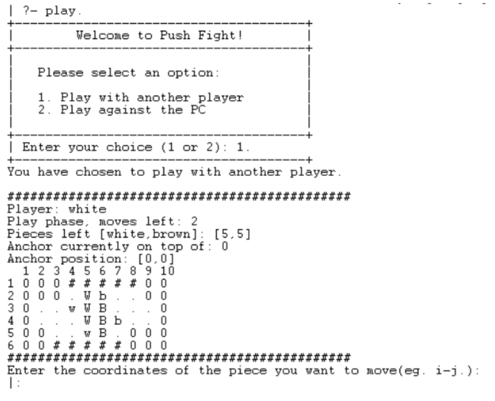

# Push Fight Game

## Introduction

The object of [Push Fight](https://www.cbf.com.br/futebol-brasileiro/competicoes/campeonato-brasileiro-serie-a) is to push one of your opponent's game pieces off the board.

## Game Overview

Players take turns placing their five pieces (three with square tops, two with sphere tops) on their half of the board, with white placing first. White then takes the first turn, and players alternate turns after that. A turn consists of 0-2 moves, then a push of one space; a player can move any of their pieces orthogonally — changing direction if desired — any number of spaces as long as those spaces are empty. A player can push only with one of their square top pieces, and they push both friendly and opposing pieces one space. After pushing, the player places the red anchor piece on the piece that pushed; this piece cannot be pushed on the opponent's next turn.
Players continue taking turns until someone pushes an opponent's piece off either end of the board. (The sides are ridged, and pieces cannot be pushed over them.)

## The Implementation

The internal game state in this Prolog program is represented by a list structure `GameState([Board, Player, MovesLeft, [WhitePiecesLeft, BrownPiecesLeft], Anchor, AnchorPosition])`. This structure encapsulates all the necessary components of the game's current status.

We then have predicates that represent the game's rules. We have predicates to validate moves, depending on the current game state (either a move or a push), and predicates to update the game state after a move or a push.

To see the full implementation, please see [Report.pl](Report.pdf) file where everything is explained in detail.

## Getting Started

To start playing Push Fight you just need to have SICStus Prolog installed on your machine. Then execute the prolog file [src/push_fight.pl](src/push_fight.pl) and run the predicate `play.`.

## Authors

Luís Tavares - up202108662
Rodrigo Rodrigues - up202108847
